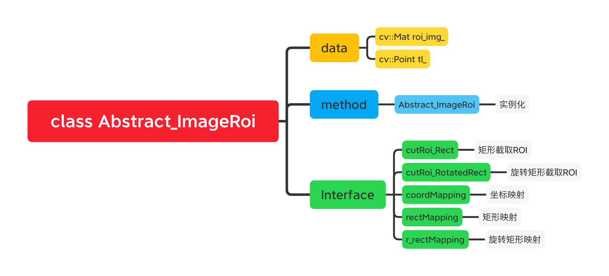

# ROI区域截取模块设计文档

## Abstract_ImageRoi 类

### Interface
- **`cutRoi_Rect`** 矩形截图

  | param       | type      | description |
  |  :-------:  | :-------: |  :-------:  |
  | _input_img  | cv::Mat   | 输入原始图像  |
  | _rect       | cv::Rect  | 感兴趣ROI区域 |

- **`cutRoi_RotatedRect`**  旋转矩形截图

  | param       | type             | description |
  |  :-------:  | :-------------:  |  :-------:  |
  | _input_img  | cv::Mat          | 输入原始图像  |
  | _rect       | cv::RotatedRect  | 旋转矩形区域  |

- **`coordMapping`** 坐标映射

  | param       | type      | description |
  |  :-------:  | :-------: |  :-------:  |
  | _input_point  | cv::Point   | 输入坐标点  |

- **`rectMapping`** 矩形映射

  | param       | type      | description |
  |  :-------:  | :-------: |  :-------:  |
  | _input_rect  | cv::Rect   | 输入矩形  |

- **`r_rectMapping`** 旋转矩形映射

  | param       | type      | description |
  |  :-------:  | :-------: |  :-------:  |
  | _input_r_rect  | cv::RotatedRect   | 输入旋转矩形  |

